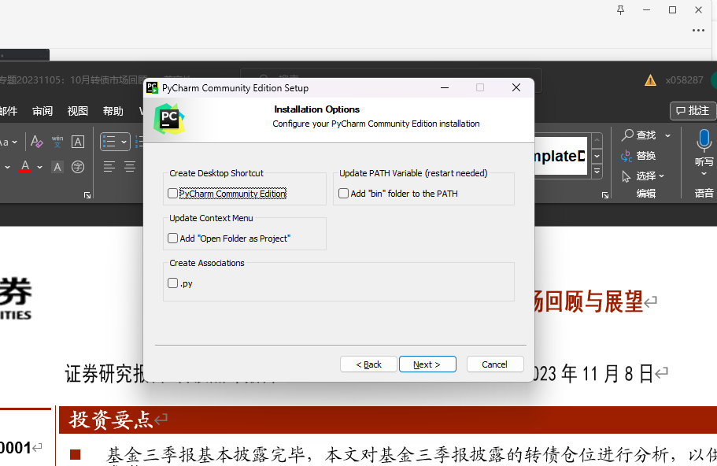
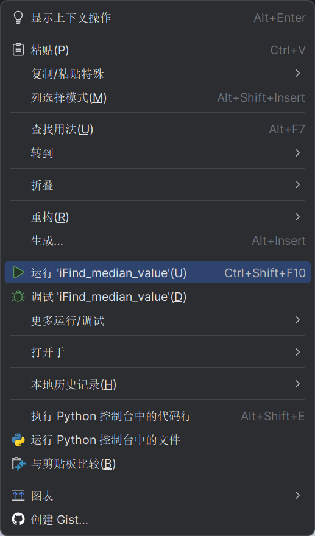

# iFind转股溢价率中位数获取

## Python环境配置

详细安装步骤参考[Python安装与环境配置超详细保姆级教程](https://blog.csdn.net/m0_57081622/article/details/127180996)

## iFind Python 环境配置

1. [点击下载](http://ft.10jqka.com.cn/index.php?c=index&a=download)同花顺数据接口
2. 第一次下载的用户，请您先打开文件夹内的`SuperCommand`并登录您的账号
3. 登录后，系统会要求您修复相关编程语言环境，请按照指示修复相关环境
4. 或在登录后点击工具中的环境设置选项，选中`Python`后点击确定按钮
5. 然后选中安装的`Python`路径，点击继续

## 安装Pycharm

1. [点击下载](https://www.jetbrains.com/pycharm/download/download-thanks.html?platform=windows&code=PCC)
2. 注意一定要勾选`Add "bin" folder to the PATH`


3. 其他步骤点击`next`即可

详细安装步骤[pycharm安装教程](https://blog.csdn.net/qq_44809707/article/details/122501118)

> 在`PyCharm`的设置->插件中可以安装中文插件

## 运行`Python`程序

1. 在`PyCharm`右上角点击文件->新建项目


2. 创建完成后，在当前目录下右键创建`Python`文件
3. 粘贴代码/[前往下载](https://github.com/ZhouBinxin/iFind/blob/master/iFind3.0.py)
```python
import numpy as np
import pandas as pd
from iFinDPy import *
import datetime
import time


# 登录函数
def login(username, password):
    thsLogin = THS_iFinDLogin(username, password)
    if thsLogin != 0:
        print('登录失败')
    else:
        print('登录成功')


# 获取数据
def get_data(edate):
    get_str = 'edate=' + edate + ';zqlx=全部'
    # jydm交易代码 f027转股价值 f022转股溢价率
    data_p00868 = THS_DR('p00868', get_str, 'jydm:Y,p00868_f027:Y,p00868_f022:Y', 'format:list')
    # print(data_p00868)
    if data_p00868.data is None:
        print(data_p00868.errmsg)

    return data_p00868


# 获取债券余额数据和债券评级
def get_bond(jydm, date):
    print("------------------债券余额数据和债券评级------------------")
    print(date)
    # ths_bond_balance_cbond债券余额数据 ths_issue_credit_rating_cbond债券评级
    data = THS_DS(jydm, 'ths_bond_balance_cbond;ths_issue_credit_rating_cbond', ';', '', date, date, 'format:list')

    if data.data is None:
        print(data.errmsg)
        return None, None

    return data.data[0]['table']['ths_bond_balance_cbond'][0], data.data[0]['table']['ths_issue_credit_rating_cbond']


# 保存数据到Excel
def save_to_excel(file_name, str_date, premium):
    print('数据保存中...')
    while True:
        try:
            if not os.path.exists(file_name):
                data = {"日期": [str_date], "转股溢价率%": [premium]}
                df = pd.DataFrame(data)
            else:
                df = pd.read_excel(file_name)
                new_data = pd.DataFrame({"日期": [str_date], "转股溢价率%": [premium]})
                df = pd.concat([df, new_data], ignore_index=True)

            df.to_excel(file_name, index=False)
            break  # 如果成功写入，跳出循环
        except PermissionError:
            print(f"请关闭文件 '{file_name}'")
            time.sleep(5)


# 计算中位数
def calculate_median(data, date):
    # 转股价值
    consider_value = True
    max_value = 120
    min_value = 100

    # 债券余额范围
    consider_balance = False
    max_balance = 100
    min_balance = 5

    # 债券评级
    consider_issue = False
    issue = "AA+"

    float_values = []

    data_jydm = data['jydm']
    data_f022 = data['p00868_f022']
    data_f027 = data['p00868_f027']

    for jydm, f027, f022 in zip(data_jydm, data_f027, data_f022):
        if '--' in f027 or '--' in f022:
            continue

        data_balance = None
        data_issue = None
        if consider_balance or consider_issue:
            data_balance, data_issue = get_bond(jydm, date)

        f027_value = float(f027)
        f022_value = float(f022)

        value_condition = (not consider_value) or (min_value < f027_value <= max_value)
        balance_condition = (not consider_balance) or (min_balance < data_balance)
        issue_condition = (not consider_issue) or (data_issue == issue)

        if value_condition and balance_condition and issue_condition:
            float_values.append(f022_value)

    return np.median(float_values) if float_values else None


# 获取数据
def get_interval_data(start_date, end_date):
    delta = datetime.timedelta(days=1)
    data_list = []

    while start_date <= end_date:
        print(start_date)
        edate = start_date.strftime("%Y%m%d")
        data = get_data(edate)
        if data.data is not None:
            data_list.append((start_date.strftime("%Y-%m-%d"), data))
        start_date += delta

    return data_list


# 主函数
def main():
    username = "账号"
    password = "密码"
    login(username, password)

    start_date = datetime.date(2023, 1, 1)
    end_date = datetime.date(2023, 11, 30)
    interval_data = get_interval_data(start_date, end_date)

    for date, data in interval_data:
        median_value = calculate_median(data.data[0]['table'], date)
        # print(median_value)
        if median_value is not None:
            save_to_excel("转股溢价率记录.xlsx", date, median_value)


if __name__ == '__main__':
    main()

```

4. 安装必要的第三方库(以下操作二选一)
	1. 将鼠标放在爆红的代码上，点击弹出的安装软件包选项
	2. 在命令行工具(`win+R` 然后输入`cmd`)中执行以下代码
	```bash
	# 安装 numpy
	pip install numpy

	# 安装 pandas
	pip install pandas
	```

> 安装过慢可以考虑更换国内源 [pycharm如何更换国内镜像源](https://blog.csdn.net/Zenglih/article/details/106975435)

```bash
# 安装 numpy，使用清华大学镜像源
pip install -i https://pypi.tuna.tsinghua.edu.cn/simple numpy

# 安装 pandas，使用阿里云镜像源
pip install -i https://mirrors.aliyun.com/pypi/simple pandas
```

5. 右键运行

## 程序相关

1. 如果仅需要一天数据，需要将`main()`函数中的`start_date`和`end_date`设置为同一天
2. `calculate_median()`函数参数说明
	1. `consider_value`、`consider_blance`、`consider_issue`
		1. 当值为`True`时，表示筛选时使用该参数
		2. 当值为`False`时，表示筛选时不使用该参数
	2. 修改筛选范围  
	```python  
	# 转股价值
    consider_value = True
    max_value = 120
    min_value = 100

    # 债券余额范围
    consider_balance = False
    max_balance = 100
    min_balance = 5

    # 债券评级
    consider_issue = False
    issue = "AA+"
	```
	3. 确定筛选边界
		1. 转股价值：value_condition = (not consider_value) or (**min_value < f027_value <= max_value**)
		2. 债券余额：balance_condition = (not consider_balance) or (**min_balance < data_balance**)